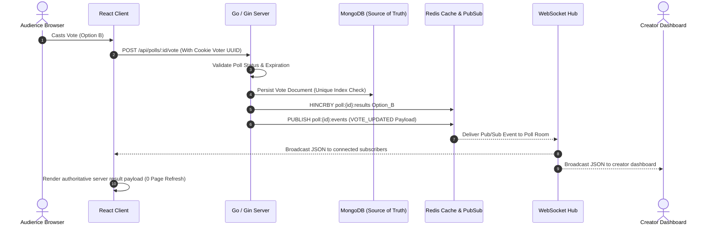

# PulseVote

> **"Opinions, in real time."**

PulseVote is a modern, production-grade real-time SaaS polling platform designed for instant audience engagement. Built with a high-performance **Go (Gin)** backend, **React + Vite** frontend, persistent **MongoDB** document storage, and a **Redis Pub/Sub + WebSocket** event streaming engine that updates vote counts live with **zero page refreshes**.

---

## 🚀 Live Demo & Repository

- **Public Repository**: [GitHub Repo](https://github.com/example/pulsevote)
- **Deployed Application**: [https://pulsevote.vercel.app](https://pulsevote.vercel.app)

---

## ✨ Features & Architecture Highlights

- ⚡ **Zero-Refresh Realtime Results**: Votes stream instantaneously to all connected audience members via WebSockets powered by a centralized Redis Pub/Sub event hub.
- 🔒 **Full SaaS Authentication**: Secure user registration, password hashing using `bcrypt`, JWT Bearer token route protection, and endpoint rate limiting.
- 📊 **Creator Dashboard**: Manage polls, track total engagement, search/filter by status (Active / Closed / Expired), and view live option percentage breakdowns.
- 🛡️ **Cryptographic Voter UUID & Unique Index**: Duplicate vote protection enforced server-side via a MongoDB **compound unique index** on `{ pollId: 1, voterIdentifier: 1 }`.
- ⏱️ **Poll Expiration & Control**: Optional automated datetime expiration and manual poll closing enforced at the backend API layer.
- 🔗 **Instant Link Sharing**: Unique public URLs (`/poll/:id`), one-click clipboard copying, QR previews, and native share dialogs.
- 🌓 **Modern Responsive UI**: Dark/Light mode theme toggle, glassmorphism cards, HSL color system, micro-animations, skeleton loaders, and celebration confetti.

---

## 🏗️ System Architecture & Data Flow

```
React Frontend (Vite + TypeScript)
       │
       │ REST API + WebSockets
       ▼
Go Backend (Gin Framework)
       │
   ┌───┴───────────────────────┐
   ▼                           ▼
MongoDB (Source of Truth)   Redis (Cache & Acceleration)
Persistent Documents        Realtime Cache & Pub/Sub
   │                           │
   └───────────┬───────────────┘
               ▼
   Centralized Redis Pub/Sub
               │
               ▼
     WebSocket Room Hub
               │
               ▼
   Connected React Clients (0 Page Refresh)
```



---

## 🔒 Duplicate Vote Prevention & Limitations

### 1. Cryptographic Voter Identity
PulseVote avoids invasive browser fingerprinting or IP-only tracking. When a voter accesses a poll, the frontend generates a cryptographically random UUID (`crypto.randomUUID()`) and stores it in a long-lived HTTP cookie (`pulsevote_voter_id`) with a local storage backup.

### 2. MongoDB Compound Unique Index
On polls where duplicate voting is disabled (`allowDuplicateVotes: false`), duplicate vote blocking is enforced **server-side** by MongoDB via a compound unique index on `{ pollId: 1, voterIdentifier: 1 }`. If a second vote with the same identifier is attempted, MongoDB rejects the insert with a duplicate key constraint error (`mongo.IsDuplicateKeyError`), returning a friendly error message to the client.

### 3. Limitations of Anonymous Duplicate Vote Protection
Because anonymous public polls do not require user authentication:
- Voters can reset their voter identity by clearing browser cookies and local storage or using a different browser/incognito profile.
- Requiring 100% strict identity verification for anonymous polls would require mandatory user registration or invasive tracking, which degrades audience conversion rates. For strict authenticated polls, creators can mandate authenticated user IDs.

---

## 🧱 Source of Truth & Redis Failure Resilience

1. **MongoDB Primary Source of Truth**: MongoDB is the sole authoritative persistent database for all polls, users, and votes.
2. **Redis as Acceleration & Realtime Layer**: Redis accelerates vote calculation (`HINCRBY`) and distributes Pub/Sub events.
3. **Graceful Fallback**: If Redis cache is empty or fails temporarily, the system automatically rebuilds current vote tallies and percentage distributions directly from MongoDB aggregation pipelines.
4. **Non-Blocking Realtime Failures**: If MongoDB vote write succeeds but Redis event publishing fails, the vote remains safely persisted in MongoDB. The server logs the Redis warning and falls back to direct WebSocket Hub room broadcasting.

---

## ⚡ Rate Limiting

Sensitive and high-traffic public API endpoints are protected with thread-safe sliding window rate limiters:
- `POST /api/auth/register`: Max 10 requests per minute per IP.
- `POST /api/auth/login`: Max 10 requests per minute per IP.
- `POST /api/polls/:id/vote`: Max 30 requests per minute per IP.

Excessive requests return HTTP `429 Too Many Requests`.

---

## 🛠️ Technology Stack

| Layer | Technology | Usage / Responsibility |
| :--- | :--- | :--- |
| **Frontend** | React 19 + Vite + TypeScript | Modern SaaS UI, React Router v6, custom CSS architecture, Dark/Light modes |
| **Backend** | Go 1.27 + Gin Framework | High-throughput REST API server, validation engine, Gorilla WebSockets |
| **Database** | MongoDB | Persistent document storage for users, polls, options, and votes |
| **Realtime Engine** | Redis + Redis Pub/Sub | Atomic vote counting (`HINCRBY`), live result caching, multi-node event distribution |
| **Authentication** | JWT (`golang-jwt/v5`) + Bcrypt | Password hashing, Bearer token authorization middleware |
| **Containerization** | Docker + Docker Compose | Local container orchestrator for MongoDB and Redis services |

---

## 📂 Project Structure

```
pulsevote/
├── backend/
│   ├── cmd/server/main.go          # Server entrypoint & initialization
│   ├── config/config.go            # Environment configuration loader
│   ├── controllers/                # Gin HTTP handlers (auth, polls, votes)
│   ├── middleware/                 # JWT Auth, CORS headers & RateLimiter middleware
│   ├── models/                     # Data structs, JSON/BSON schemas, DTOs
│   ├── repositories/               # MongoDB queries & compound unique index management
│   ├── services/                   # Business logic (auth, poll CRUD, voting)
│   ├── redis/                      # Redis client, caching, Pub/Sub publisher/subscriber
│   ├── websocket/                  # Multi-room WebSocket hub & client pumps
│   ├── tests/                      # Go unit & integration test suites
│   ├── go.mod                      # Go module definition
│   └── go.sum                      # Go module checksums
├── frontend/
│   ├── src/
│   │   ├── components/             # Reusable UI (Navbar, Footer, Modals, Skeleton)
│   │   ├── components/polls/       # Poll components (LiveResultsChart, VoteForm, ShareModal)
│   │   ├── context/                # React Contexts (AuthContext, ThemeContext, ToastContext)
│   │   ├── hooks/                  # Custom hooks (useWebSocket with auto-reconnect)
│   │   ├── pages/                  # Route views (Landing, Login, Register, Dashboard, Poll)
│   │   ├── services/               # API clients (api, auth.service, poll.service)
│   │   ├── styles/                 # CSS design system (variables.css, index.css)
│   │   ├── types/                  # TypeScript interface definitions
│   │   ├── App.tsx                 # Main router & protected route guards
│   │   └── main.tsx                # React root mount
│   ├── package.json
│   └── vite.config.ts
├── docker-compose.yml              # Local MongoDB & Redis service containers
├── .env.example                    # Blueprint environment variables
├── .gitignore
└── README.md
```

---

## 💻 Local Setup & Installation

### Prerequisites
- [Go 1.22+](https://golang.org)
- [Node.js 18+](https://nodejs.org)
- [Docker & Docker Compose](https://www.docker.com)

### Step 1: Clone & Configure Environment
```bash
git clone https://github.com/example/pulsevote.git
cd pulsevote

# Copy environment template
cp .env.example .env
```

### Step 2: Start MongoDB & Redis via Docker
```bash
docker-compose up -d
```
*Services listening at:*
- MongoDB: `localhost:27017`
- Redis: `localhost:6379`

### Step 3: Run Go Backend
```bash
cd backend
go run ./cmd/server
```
*Backend listening at `http://localhost:8080`*

### Step 4: Run React Frontend
```bash
cd ../frontend
npm install
npm run dev
```
*Frontend running at `http://localhost:5173`*

---

## 🧪 Testing

Run backend unit tests for registration, authentication, poll creation validation, authorization, duplicate voting protection (MongoDB unique index), and rate limiting:

```bash
cd backend
go test ./tests/... -v
```

---

## 🔒 Security Architecture

1. **Password Safety**: Passwords hashed with `bcrypt` (cost factor 10). Plaintext passwords are never stored or logged.
2. **JWT Authorization**: Authenticated routes protected by Bearer token middleware with `HS256` signature verification.
3. **Strict Validation**: All input fields validated server-side for string lengths, duplicate options, valid email formats, and expiration bounds.
4. **CORS Restrictions**: Configured strictly to prevent unauthorized cross-origin request forgery.
5. **No Secrets in Git**: All sensitive credentials managed via environment variables.

---

## 🤖 AI Assistance Disclaimer

Built with pair programming assistance from Google DeepMind's Antigravity AI assistant. Architecture design, data flow validation, code organization, and testing were conducted interactively to adhere to senior software engineering standards.

---

## 📜 License

MIT License. Built for the HCL GUVI Full Stack Development Intern assignment.
